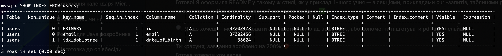

# hsa13-hw8-sql-databases
InnoDB Indexes Use MySQL (or fork) with InnoDB. Make a table for 40M users. Compare performance of selections by date of birth: Without index With BTREE index With HASH index Check insert speed difference with different innodb_flush_log_at_trx_commit value and different ops per second.

### Technologies Used
- Java 17 + Spring Boot
- MySQL 8.0 (InnoDB)
- Docker & Docker Compose
- Siege for benchmarking

---

### 1. Insert 40M users into MySQL

The dataset of 40 million users was inserted via a separate loader container using batched inserts. Each row includes: `id`, `name`, `email`, `date_of_birth`.

---

### 2. SELECT Queries with Different Indexing Strategies

#### a) No Index

```bash
curl http://localhost:8080/select/no-index
```

Result:
```
Query executed in: 220 ms, rows: 1000
```

#### b) BTREE Index

Create index:
```bash
curl -X POST "http://localhost:8080/index/create?type=BTREE"
```

```sql
SHOW INDEX FROM users;
```
Result:
```
idx_dob_btree | date_of_birth | BTREE
```


Run SELECT with index:
```bash
curl http://localhost:8080/select/btree-index
```

Result:
```
Query executed in: 100 ms, rows: 1000
```

#### c) HASH Index

Create index:
```bash
curl -X POST "http://localhost:8080/index/create?type=HASH"
```

```sql
SHOW INDEX FROM users;
```
Result:
```
idx_dob_hash | date_of_birth | BTREE (InnoDB always stores as BTREE)
```


Run SELECT with index:
```bash
curl http://localhost:8080/select/hash-index
```

Result:
```
Query executed in: 131 ms, rows: 1000
```

#### Summary Table

| Index Type   | Query Time (ms) | Rows |
|--------------|------------------|------|
| No Index     | 220              | 1000 |
| BTREE        | 100              | 1000 |
| HASH (BTREE) | 131              | 1000 |

#### Insights:
- Queries with an index are significantly faster.
- HASH index (implemented as BTREE) was slightly slower than BTREE in this test.
- InnoDB does not support true HASH indexes, but still parses the `USING HASH` syntax.

---

### 3. INSERT Performance with Different `innodb_flush_log_at_trx_commit` Values

#### Setup:

```bash
curl -X POST "http://localhost:8080/config/flush-log?value=0"
siege -c20 -t20S -f urls.txt

curl -X POST "http://localhost:8080/config/flush-log?value=1"
siege -c20 -t20S -f urls.txt

curl -X POST "http://localhost:8080/config/flush-log?value=2"
siege -c20 -t20S -f urls.txt
```

#### Results:

| flush_log | Transactions | TPS     | Response Time | Longest Tx |
|-----------|--------------|---------|----------------|-------------|
| 0         | 49,939       | 2384.86 | 2.39 ms        | 50 ms       |
| 1         | 44,466       | 2203.47 | 2.21 ms        | 20 ms       |
| 2         | 43,028       | 2021.04 | 2.20 ms        | 20 ms       |

#### Observations:
- `flush_log = 0` gives maximum performance, at the cost of potential data loss on crash.
- `flush_log = 1` is the safest but slowest.
- `flush_log = 2` offers a good compromise between safety and speed.

---

### How to Use

**1. Start the Environment**
```bash
docker compose up -d --build
```

**2. Run the API Locally (optional for development)**
```bash
./mvnw clean package
java -jar target/app.jar
```

**3. Insert Sample User**
```bash
curl -X POST http://localhost:8080/insert
```

**4. Create/Drop Index**
```bash
curl -X POST "http://localhost:8080/index/create?type=BTREE"
curl -X POST "http://localhost:8080/index/drop?type=BTREE"
```

**5. Set Flush Log Mode**
```bash
curl -X POST "http://localhost:8080/config/flush-log?value=1"
```

**6. Run Siege Test**
```bash
siege -c20 -t20S -f urls.txt
```


